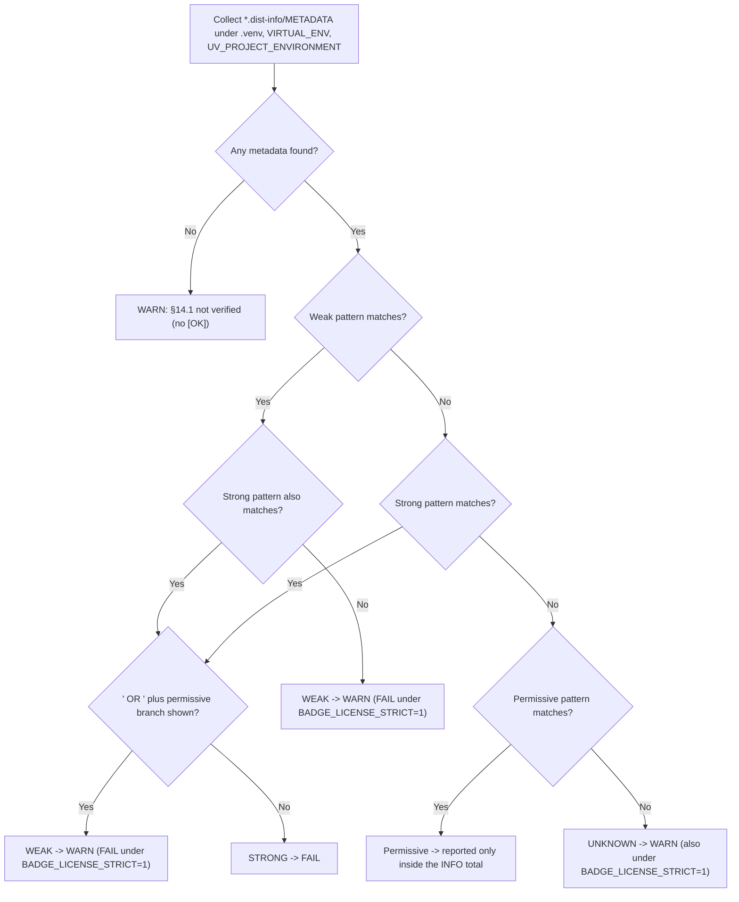

# BADGE Constitution — Dependency License Policy

Policy for dependency licenses in a BADGE project. It turns §14.1 (license constraints) into
machine-checkable rules and records exactly where the line between **FAIL** and **WARN** is drawn.

The policy is enforced by section 4 of `tools/check_dependencies.sh`; this document is its
human-readable counterpart. Facts below were taken from that script's source, not from memory.
Per §15.1 ("宪法定义检查类别，脚本定义具体匹配模式"), §14.1 defines the category — the script defines
the concrete patterns. The check is **strictly offline**: no registry lookup and no HTTP request is
performed.

---

## 1. What is inspected

Data source: the distribution metadata that `uv sync` writes into the virtual environment —
`*.dist-info/METADATA` — using these fields:

| Field | Role |
|---|---|
| `License-Expression:` | PEP 639 structured expression; preferred for **display** |
| `License:` | legacy free-text license field |
| `Classifier: License :: OSI Approved :: …` | trove classifiers; **all** of them are concatenated |

Roots searched for `*.dist-info/METADATA`, in order: `$PROJECT_ROOT/.venv`, `$VIRTUAL_ENV`,
`$UV_PROJECT_ENVIRONMENT` (each only when that directory exists), plus a shallow fallback scan of
the project tree (`-maxdepth 3`, skipping `.venv/`). Paths are de-duplicated and sorted.

**`uv.lock` is NOT a data source.** uv emits no per-package `license` field, so a check that grepped
`license = "…"` out of `uv.lock` matched nothing and still printed "[OK] No obvious copyleft
dependencies" — a false pass that hid every copyleft dependency. The rule that replaces it: never
claim `[OK]` when no metadata could actually be inspected.

---

## 2. Severity

| Classification | Default (`BADGE_LICENSE_STRICT` unset or `0`) | With `BADGE_LICENSE_STRICT=1` |
|---|---|---|
| Strong copyleft | **FAIL** | **FAIL** |
| Weak copyleft | WARN | **FAIL** |
| Permissive-dual `… OR <permissive>` (recorded as WEAK, §3) | WARN | **FAIL** |
| Unclassifiable license text | WARN | WARN (unchanged) |
| Nothing could be inspected | WARN | WARN (unchanged) |

- **FAIL** — strong copyleft: GPL / AGPL / SSPL and their spelled-out names. §14.1 forbids GPL,
  AGPL and equivalent viral licenses; there is no switch that turns this off.
- **WARN** (weak copyleft) — the finding is printed with package, version and the license text that
  produced it; the human decides whether the dependency can be used.
- **WARN** (unclassifiable) — a license string that matched no pattern. Unknown text is *not*
  treated as a proven problem, but it is never silently accepted.
- **WARN** (nothing inspected) — no `*.dist-info/METADATA` was found under any root. §14.1 is
  reported as **not verified**, with the hint to run `uv sync`.

`[OK]` is printed only when at least one distribution was actually inspected **and** no strong,
weak or unclassifiable license was found.

---

## 3. Classification

Classification is case-insensitive (`grep -qiE`) and runs against the concatenation of all three
fields (`License-Expression | License | classifiers`). The patterns are, verbatim from the script:

- **Strong copyleft**
  `(^|[^[:alpha:]])(A?GPL|SSPL)([^[:alpha:]]|$)|GNU General Public License|Server Side Public License`
- **Weak copyleft**
  `LGPL|Lesser General Public License|MPL|Mozilla Public License|EPL|Eclipse Public License|CDDL|Common Development and Distribution License|EUPL|European Union Public Licen[cs]e|CC-BY-(SA|NC)|OSL|CECILL|CPL`
- **Permissive**
  `MIT|Apache|BSD|ISC|PSF|Python Software Foundation|Unlicense|0BSD|Zlib|CC0|BlueOak|Public Domain|Boost|Artistic`

**Order matters.** The weak test runs *before* the strong test, so `LGPL-2.1` is never mistaken for
`GPL` by substring matching; the strong pattern additionally requires a non-letter boundary before
`(A?GPL|SSPL)`, so the `GPL` inside `LGPL` can never match. If a text matches both weak and strong
(e.g. `LGPL-2.1 OR GPL-3.0`), the result is **STRONG**. A text that matches only permissive
patterns is permissive; anything else is unclassifiable.

### Dual licensing

A package usable under a permissive branch is not a hard failure. A finding classified **STRONG** is
downgraded to weak — i.e. WARN — when the **displayed** value (the first non-empty of
`License-Expression`, `License`, classifiers) contains the literal ` OR ` **and** matches the
permissive pattern. `MIT OR GPL-3.0` therefore lands at WARN, not FAIL; the choice stays visible in
the report. `LGPL-2.1 OR GPL-3.0` does not: no permissive branch is named, so it stays STRONG → FAIL.

**That downgrade is itself a WEAK classification — and §4's strict switch acts on WEAK.** The
rewrite sets the class to `WEAK` (`check_dependencies.sh:201-204`), and `BADGE_LICENSE_STRICT=1`
fails every WEAK finding (§4). A permissive-dual such as `MIT OR GPL-3.0` therefore lands at WARN
**only with the switch left off**: under `BADGE_LICENSE_STRICT=1` it becomes a `[FAIL]` with exit
code 1. The "not a hard failure" sentence above describes the default run.



---

## 4. The opt-in strict switch

`BADGE_LICENSE_STRICT=1` is **opt-in and off by default** (`LICENSE_STRICT="${BADGE_LICENSE_STRICT:-0}"`).
When set to `1` it does exactly one thing: every finding the script recorded as **WEAK** becomes a
**FAIL** and the check's exit code becomes non-zero. That covers both the genuinely weak-copyleft
licenses and the permissive-dual findings that §3 downgraded to WEAK — so a dependency whose
`License-Expression` is `MIT OR GPL-3.0` is `[WARN]` by default and **fails** under the switch.

It does **not** change the other two WARN cases, and this asymmetry is deliberate and verified in the
source — the strict value is read only inside the weak branch:

- "no metadata could be inspected" has no strict branch → stays **WARN**;
- "license text could not be classified" has no strict branch → stays **WARN**, as the script's own
  comment states ("unknown/unclassifiable licenses stay WARN under the strict switch").

So the switch never converts *ignorance* into failure; it only converts a **known, named** finding —
a weak-copyleft license, or a dual expression with a permissive branch — from "review this" into
"this fails".

Relation to §3.3 (pre-authorized fallbacks): §3.3 asks that a decision which changes an outcome
significantly be declared **before deployment, default off, never taken at runtime**. This switch
follows that posture — it is an explicit, environment-level declaration made before the gate runs,
never inferred and never per-command. It differs from a §3.3 fallback in direction: it can only
**tighten** the gate (§14.1's ban on strong copyleft is unconditional either way), never relax one,
and never changes a *runtime* result — it only makes this one gate stricter.

---

## 5. Scope of this document

The same script also enforces unrelated dependency rules — §14.2 (uv as the sole package manager;
the forbidden `requirements.txt` / `Pipfile` / `poetry.lock` / `setup.py` family; required
`pyproject.toml`, `uv.lock`, `.python-version`) and §19.3 (`LICENSE` exists in the repository root;
a `LICENSE` whose first five lines do not look like MIT/Apache is a WARN). Those are process rules,
not license policy, and are out of scope here.

---

## 6. Reproducible evidence

Run from the repository root:

```bash
# The three classification patterns
grep -n -E '_LICENSE_(STRONG|WEAK|PERMISSIVE)_RE=' tools/check_dependencies.sh

# Classification order (weak before strong, boundary before GPL)
grep -n -E 'Order matters: the weak|_license_class\(\) \{' tools/check_dependencies.sh

# The dual-license downgrade
grep -n -E 'A dual expression with a usable permissive branch|cls="WEAK"' tools/check_dependencies.sh

# Which roots are inspected
grep -n -F 'LICENSE_ROOTS=' tools/check_dependencies.sh

# Severity mapping; note that $LICENSE_STRICT appears only in the weak branch
grep -n -F 'LICENSE_STRICT' tools/check_dependencies.sh

# Why the strict switch also fails a permissive dual (§3): the downgrade
# rewrites the class to WEAK, and the strict branch acts on WEAK.
grep -n -F 'cls="WEAK"' tools/check_dependencies.sh
grep -n -F 'weak copyleft dependency found (BADGE_LICENSE_STRICT=1' tools/check_dependencies.sh

# Run the check itself
bash tools/check_dependencies.sh
```
