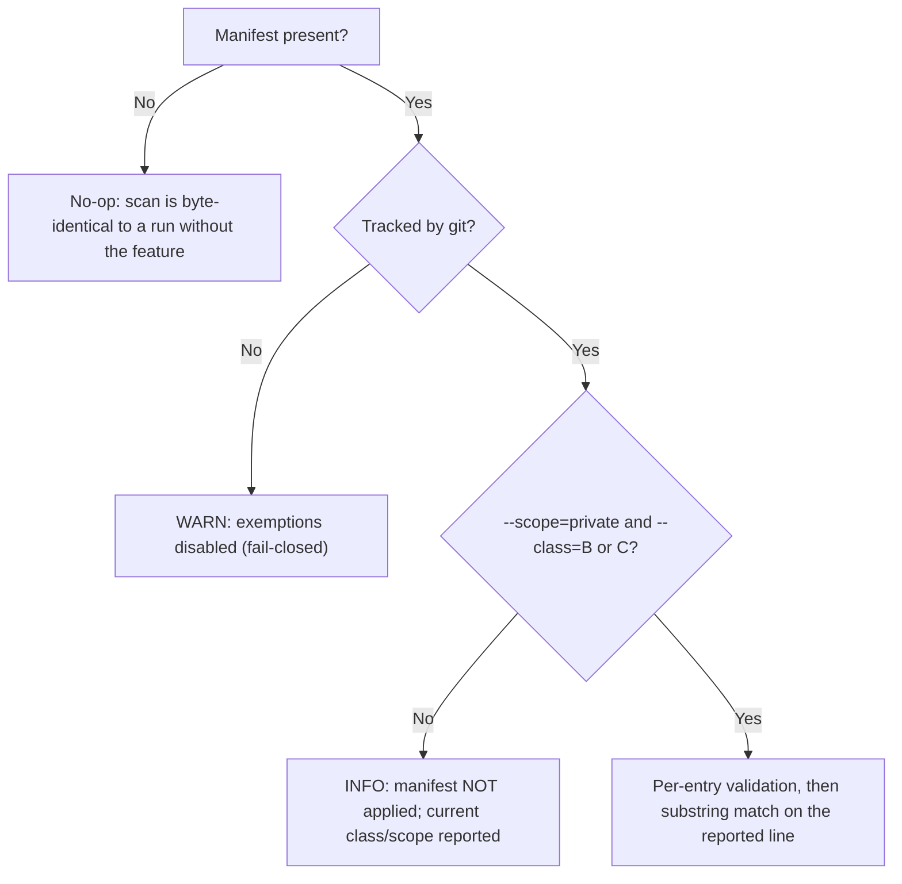

# BADGE Constitution — Opt-In Exemption Mechanisms

Two optional, repo-root manifests let a project declare — **in advance and by name** — exceptions to
two specific tool checks:

| Manifest | Check | Clause |
|---|---|---|
| `.badge/vendored.txt` | `tools/check_legacy_cleanup.sh` | §18.1 |
| `.badge/secrets-exempt.tsv` | `tools/check_secrets.sh` | §15.4 (tier gate), §15.1 |

Both are **engineering mechanisms, not constitution-level rights**. Per §15.1 ("宪法定义检查类别，
脚本定义具体匹配模式"), the constitution states the category to be checked, while the script defines
the concrete matching patterns and the exemption format. The constitution text does not carry either
manifest's syntax, and this document describes the behaviour of the two scripts, not a new clause.

---

## 0. Contract common to both

- **Opt-in.** Neither manifest is created by any tool. Each mechanism is guarded by a file-existence
  test, so when the file is absent the scan is exactly what it was before the feature existed and no
  manifest-related line is printed. An empty or comment-only manifest is likewise inert.
- **WARN-stale visibility.** Both mechanisms report declarations that rotted, so a manifest cannot
  silently outlive the finding it was written for.
- **Independent — and not the same model.** Each mechanism only ever relaxes the single check that
  reads it, and the two relax differently: `.badge/vendored.txt` removes whole declared paths from
  the §18.1 scan before any finding is produced (§1), while `.badge/secrets-exempt.tsv` keeps the
  finding and changes its severity label (§2).

**The two guarantees below are `.badge/secrets-exempt.tsv`-only.** They do not describe
`.badge/vendored.txt`, which has no tracked-file check and emits no per-finding warnings (see the
note closing §1):

- **Downgrade only, never silent (secrets manifest).** An exemption never deletes a finding: the
  finding is printed verbatim as a `[WARN]` together with the reason the project gave, and the run
  reports how many findings were downgraded. Nothing is hidden.
- **Fail-closed (secrets manifest).** A manifest that is untracked, malformed, incomplete, names a
  forbidden category, uses a glob/absolute path, or points at a path that does not exist is **not
  applied**; each such entry is reported. An entry that is valid but matches no finding is reported
  as **stale**.

---

## 1. `.badge/vendored.txt` — third-party code under §18.1

§18.1 governs **first-party** architecture: no `legacy/` directories, no version/legacy suffixes, no
"keep it just in case" compatibility shims. Third-party or upstream code carried in-tree
legitimately contains phrases like "backward compatibility" and `legacy_`-style names, and must not
be flagged. The manifest declares those paths.

**Format** (`tools/check_legacy_cleanup.sh`, header of the script):

```text
# one repository-relative path PREFIX per line
# blank lines are ignored; '#' starts a comment (a '#' after whitespace ends the entry)
src/isaaclab/
vendor/
```

Parsing: trailing CR is stripped, the entry is trimmed on both sides, and everything from a
whitespace-preceded `#` onwards is dropped. A matching tracked path is removed from the §18.1 scan
for that run; the skipped paths and their count are printed (first 20 shown, then "… and N more").

**Refused — and why (these are guardrails so a declaration cannot switch the check off):**

| Declaration | Result |
|---|---|
| An absolute path (`/…`) or anything containing `..` | `[WARN]` — ignored as unsafe/non-relative |
| `.`, `./`, or any non-blank prefix that normalises to `.`/`..` (blank and whitespace-only lines are skipped before this test) | `[FAIL]` — it would cover every tracked file |
| A prefix normalising to a first-level **own source directory**: `src`, `tests`, `scripts`, `docker`, `tools` | `[FAIL]` — §18.1 governs first-party code; `src`, `src/` and `./src/` are all recognised |
| A declaration that leaves **zero `.py` files** in the scan while the scan had some before | `[FAIL]` — that is a one-line switch to disable the check |
| A valid prefix that matches **no tracked file** | `[WARN]` — stale or misspelled |

Because the refusals are blocking `[FAIL]`s, a manifest that contradicts §18.1 makes the run fail
rather than making it pass.

**Known difference from the secrets manifest.** This manifest is checked for *file existence* only:
`check_legacy_cleanup.sh` never tests whether `.badge/vendored.txt` is git-tracked, so an untracked
local copy applies exactly like a tracked one (evidence in §3). Relaxing here also means *removing
the declared paths from the scan before findings exist*, so they appear once as `[INFO]` and there
is no per-finding `[WARN]` carrying the project's reason. Closing either gap would be a change to
`tools/check_legacy_cleanup.sh`, not to this document.

---

## 2. `.badge/secrets-exempt.tsv` — project-level §15.4 exemptions

§15.1 requires a secrets scan before every commit; §15.4 grants an exception only to a B-class or a
private C-class repository, and explicitly never to credentials or employee personal sensitive
information ("凭据类信息不适用任何例外"; red line "所有类别、所有可见性，永不放宽"). The manifest
therefore may cover **only non-red-line internal information**.

**Format** — one entry per line, four TAB-separated columns:

```text
<rule-id><TAB><repo-relative-path><TAB><matched-substring><TAB><reason>
```

`#` starts a comment line, blank lines are ignored, and a trailing CR is stripped. The manifest
itself is excluded from the scan only while it is active — i.e. only when it is git-tracked and the
tier gate has passed — so it cannot flag the very strings it quotes.

**Tier gate.** Exemptions apply only when the run explicitly declares the private tier:



With the default public scope — or with `--class=A`, which `check_secrets.sh` rejects outright
together with `--scope=private` — the manifest is ignored and a notice states the current class and
scope.

**Exemptable rule ids — exactly four:**

```text
private_ip
internal_path
history_private_ip
history_internal_path
```

`private_ip` and `internal_path` are §15.4-relaxable internal information (intranet IPs, internal
paths); the `history_*` variants are the same categories found in git history. An id that is outside
this list is ignored with a `[WARN]`.

**Red lines — naming one is itself a failure.** These ids are known to the script and can never be
exempted; an entry naming one is rejected loudly and the run fails (the entry is not applied, so the
manifest does not take effect for it):

```text
api_key  hardcoded_credential  jwt  cloud_credential_ref  ssh_ip  ssh_user_host
pii_email  pii_mobile  pii_landline  pii_im  pii_idcard
history_api_key  history_credential  history_jwt  history_ssh_ip  history_ssh_user_host
history_pii_email  history_pii_mobile  history_pii_landline  history_pii_im  history_pii_idcard
```

**Per-entry validation** — an entry is discarded (with a warning, fail-closed) when:

- it has more than four fields, or any of the four fields is empty;
- the path is absolute, contains `*`, `?` or `[` (glob), or contains `..`;
- the path does not exist in the working tree (`[ -e ]` check);
- the rule id is unknown (not in the four above).

**How a match is made.** The path is compared for equality against the path parsed out of the
reported line — for working-tree findings the line is `<file>:<line>:<content>` and the file is the
first field; for history findings it is `<grep-line>:<commit>:<file>:<content>` and the file is the
third field. The `<matched-substring>` must appear in the line. An exempted finding becomes a
`[WARN]` that still prints the finding plus `whitelisted: <reason>`; at the end the run adds a
summary count, and any declared entry that matched nothing is reported as stale.

The net effect is a **named, reasoned, per-file and per-string** exemption — the granularity is
deliberately too fine to switch a whole category off. Its **severity effect is neutral, though.**
The four exemptable ids are §15.4-relaxable categories, and the only run in which the manifest is
applied at all is `--scope=private` with `--class=B|C` — precisely the tier in which those
categories are *already* reported as `[WARN]` rather than `[FAIL]` (`print_scope_aware` /
`print_history_scope_aware`, `relaxable` tier). The manifest therefore **never turns a FAIL into a
WARN and never changes pass/fail**: with or without it these findings exit 0, and the difference is
limited to the label ("… downgraded FAIL→WARN by the project whitelist"), the `whitelisted:
<reason>` line and the stale ledger. The tool's own "downgraded FAIL→WARN" wording describes its
internal bookkeeping, not a severity the run would otherwise have had. Red-line ids are rejected
outright, so no entry can rescue a failing scan. Read this manifest as a **named justification and
staleness ledger**, not as a rescue switch.

---

## 3. Reproducible evidence

Run from the repository root:

```bash
# The anchors below replace hardcoded line numbers: each prints the current
# line number of the named construct, so the evidence survives any edit above
# it in the script.

# vendored manifest: format, protected dirs, whole-repo refusal, .py guardrail
grep -n -E 'one repository-relative path PREFIX per line|VENDORED_MANIFEST=|VENDORED_PROTECTED_DIRS=|would cover every tracked file' \
    tools/check_legacy_cleanup.sh
grep -n -E 'removes every \.py file from the §18\.1 scan|declared prefix matched no tracked file' \
    tools/check_legacy_cleanup.sh

# secrets manifest: the four exemptable ids and the red-line id list
grep -n -E 'SECRETS_EXEMPT_(ALLOWED|REDLINE)_RULES=' tools/check_secrets.sh

# per-entry validation (fields, red lines, unknown rules, path checks)
grep -n -E 'too many fields|missing field|can NEVER be exempted|unknown rule|path must be an exact|does not exist — entry ignored' \
    tools/check_secrets.sh

# match lookup, downgrade-only split, exempted WARN block, stale report
grep -n -E '_wl_lookup\(\)|wl_split\(\)|wl_emit_exempted\(\)|_wl_stale_report\(\)' \
    tools/check_secrets.sh

# manifest exclusion and the end-of-run summary
grep -n -F 'grep -vxF' tools/check_secrets.sh
grep -n -F 'downgraded from FAIL to WARN by the project whitelist' tools/check_secrets.sh

# Opt-in proof: in a repository with no .badge/ manifest, no manifest-related
# line can appear — both blocks are behind a file-existence guard.
grep -n 'VENDORED_MANIFEST" \]'  tools/check_legacy_cleanup.sh
grep -n 'SECRETS_EXEMPT_FILE'    tools/check_secrets.sh

# Known difference (§1 note): the vendored manifest is guarded by file existence
# only — there is no git-track test on the vendored side, unlike the secrets side.
grep -n -F '[ -f "$VENDORED_MANIFEST" ]' tools/check_legacy_cleanup.sh
grep -n 'ls-files --error-unmatch' tools/check_secrets.sh   # the secrets-side track gate

# And the scans themselves, for comparison against a v2.8.0 run
bash tools/check_legacy_cleanup.sh
bash tools/check_secrets.sh --class=C --scope=public
```
